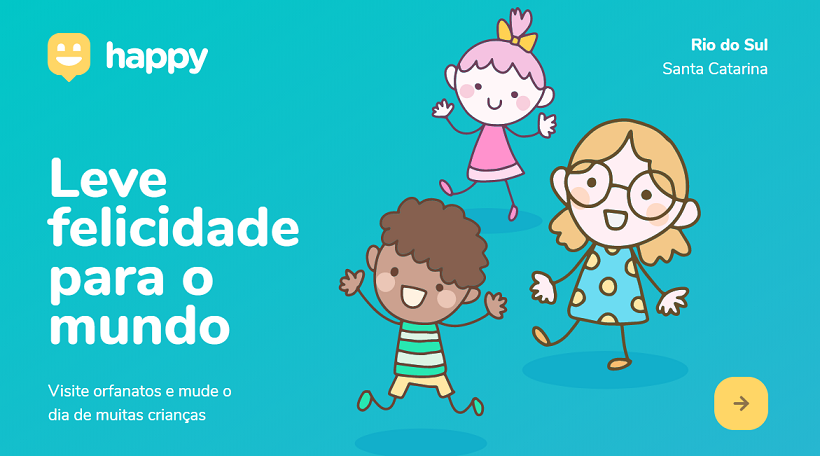
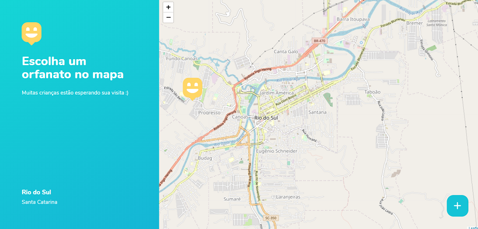
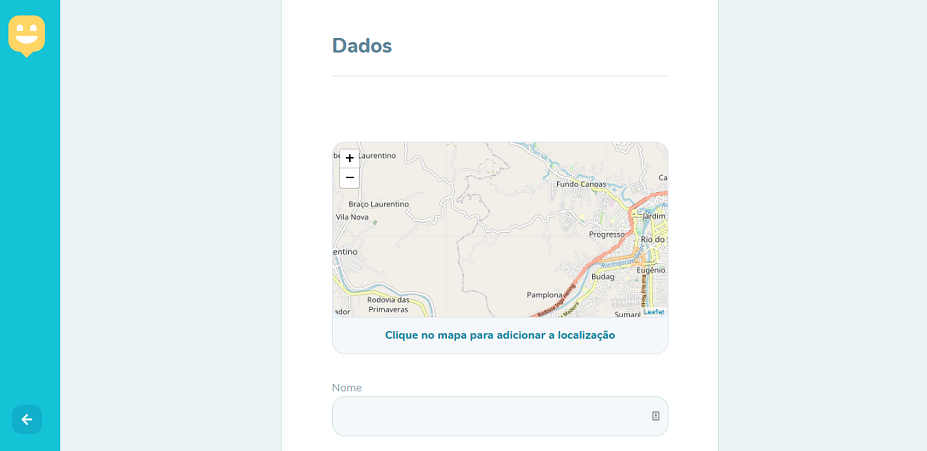
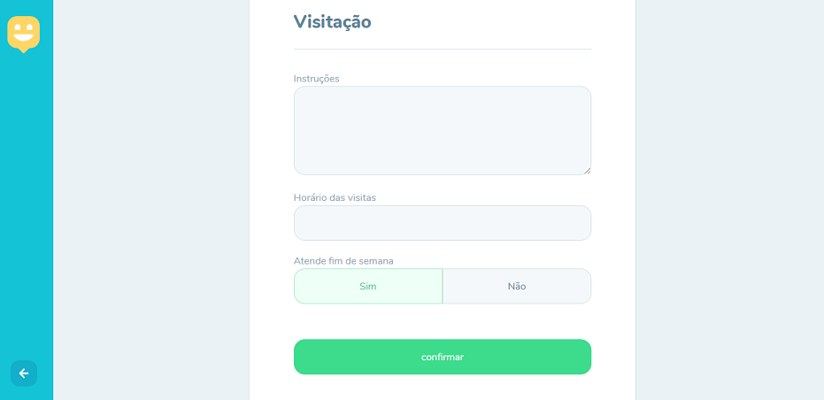
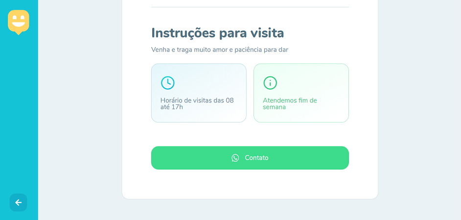

# NLW-HAPPY
## Projeto Rocketseat de gerenciamento de orfanatos
### Next Level Week-Rocketseat
##### Esse projeto traz mais acessibilidade a população aos orfanatos próximos a sua residencia, podendo ter acesso a mapas e possibilitando o agendamento de visitas e cadastramento de novos orfanatos. Esse projeto tem como objetivo aumetar o número de visitas nos orfanatos  trazendo mais alegria as crianças, que precisam além de doação, muito amor.

VÍDEO...

FOTOS...

 
